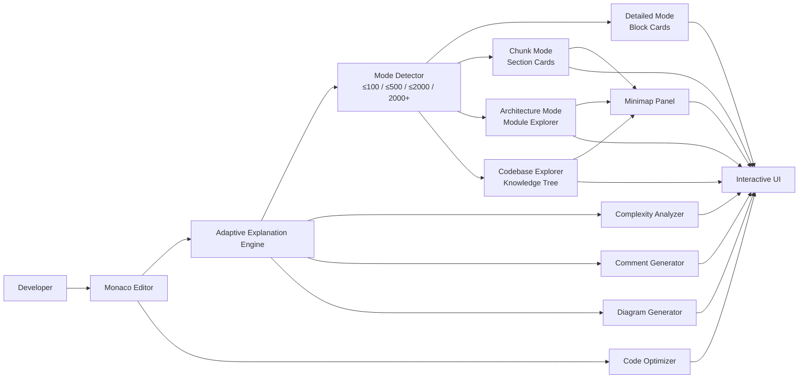

<p align="center">
  
</p>

<h1 align="center">CodeExplainer</h1>

<p align="center">
  <strong>Transform any codebase into interactive explanations, visual walkthroughs, complexity analysis, diagrams, and production ready documentation — all in your browser.</strong>
</p>

<p align="center">
  
  
  
  
  
</p>

---

## 📖 Overview

CodeExplainer is an adaptive code understanding platform built for developers, students, educators, and interview candidates. Rather than returning a wall of AI-generated text, it analyzes the **structure** of your code and produces a rich, interactive experience tailored to both the size and complexity of what you paste.

It automatically switches between four explanation modes based on file length from deep line by line walkthroughs of small snippets to full architectural maps of large codebases.

---

## ✨ Features

### 🗺️ Adaptive Explanation Engine

The core engine detects how large your code is and selects the right explanation strategy automatically.

| Lines of Code | Mode | What you see |
|---|---|---|
| 0 – 100 | **Detailed** | Step-by-step block cards, variable tracking, execution timeline |
| 101 – 500 | **Chunk Mode ⚡** | Logical section cards with code previews and function breakdowns |
| 501 – 2 000 | **Architecture Mode 🏗️** | Module explorer, data-flow strip, cyclomatic complexity per function |
| 2 000+ | **Codebase Explorer 🗺️** | System overview, entry-point map, collapsible knowledge tree |

#### Minimap Sidebar
In all non-detailed modes a **Minimap Panel** appears on the left of the explanation area. It lists every detected section or module with its line range. Clicking any item scrolls Monaco to that block and highlights the full range inline.

---

### 🧠 Three Depth Layers

Every explanation is generated at three reading depths, selectable from the toolbar:

| Button | Audience | What you get |
|---|---|---|
| **30s Summary** | All levels | A concise conceptual overview in plain language |
| **5m Overview** | Intermediate | Logical flow, data pathways, complexity overview |
| **Deep Dive** | Expert | Loop invariants, branch prediction, escape analysis, optimization opportunities |

Switching depths is instant — all three are pre-generated on a single Explain click.

---

### 🔍 Step-by-Step Walkthrough *(Detailed mode)*

For small files (≤ 100 lines) you get a fully interactive execution timeline:

- Expandable **block cards** per code structure (function, loop, conditional, variable, return)
- Animated card transitions between steps
- **Variable state panel** showing cumulative state up to the current step
- Playback controls — play, pause, step forward/back, jump to end, adjustable speed (0.5×–4×)
- "All Steps" sidebar for instant jump navigation

---

### ⚡ Chunk-Based Navigation *(101–500 lines)*

Large snippets are broken into semantic sections automatically:

- Sections labeled: Imports, Authentication, API Routes, Database, Validation, React Hooks, UI Components, Error Handling, Utilities, and more
- Each card shows the section's **line range**, **code preview** (first 3 lines), and all **functions** it contains
- Function cards include name, line bounds, and an estimated **Cyclomatic Complexity** badge (green / amber / red)
- Clicking a card highlights the full range in Monaco editor

---

### 🏗️ Architecture View *(501–2 000 lines)*

Larger files are mapped into semantic **modules**:

- **Data-flow strip** — scrollable pill chain showing module relationships (Auth → API → Database → …)
- Collapsible module cards listing contained functions with complexity estimates
- Clicking a module scrolls Monaco to that section and applies a **multi-line range highlight**

---

### 🗺️ Codebase Explorer *(2 000+ lines)*

For very large files the app switches into navigator mode:

- **System Overview** card (depth-aware: 30s / 5m / expert summary)
- **Entry-point chips** — clickable quick-jumps to major modules
- **Collapsible Knowledge Tree** — recursive tree of modules → functions with line references
- All nodes are clickable and sync with Monaco

---

### 📊 Complexity Analysis

Instant performance insights for every file:

- Time & Space complexity estimation
- Cyclomatic complexity count
- Bottleneck identification
- Optimization recommendations (per depth level)
- Complexity breakdown table per detected block

---

### 🌐 Visual Diagrams

Mermaid diagrams generated automatically:

- **Flowchart** — sequential or architecture-level flow
- **Sequence Diagram** — execution order across components
- **Class Diagram** — detected classes and their methods

In architecture/explorer mode the flowchart maps **module relationships** rather than individual statements.

---

### 📝 Smart Comment Generator

Generate production-ready documentation without modifying your source:

- Ghost-rendered **inline comments** overlaid in Monaco (not injected into your code)
- **Block comments** and **docstrings** per function
- Depth-sensitive comment style (plain English → technical → expert-grade)
- Togglable with `⌘ /` — comments appear and disappear without touching the code

---

### ⚡ Code Optimizer

Side-by-side optimization workspace:

- Before / after comparison with original code preserved
- Code quality and complexity improvement scores
- Maintainability analysis
- Performance recommendations

---

### Variable Inspector

Real-time variable tracking synchronized with the execution timeline:

- Current value per variable at each step
- Scope visibility (local / parameter)
- Flash animation on state change

---

### 🖊️ Annotation System

Click any line number in Monaco to open the annotation panel:

- Add private notes to specific lines
- Confusing lines marked with a colored gutter indicator
- Annotation panel slides in without disrupting layout

---

### 📤 Export

Share or save your analysis in multiple formats:

- **Markdown** — copy-paste ready
- **HTML** — styled standalone page
- **Notion import** — compatible markdown
- **PDF** — full analysis with code block

---

## ⌨️ Keyboard Shortcuts

| Shortcut | Action |
|---|---|
| `⌘ Enter` | Analyze / Explain code |
| `⌘ /` | Toggle inline comments |
| `⌘ D` | Toggle dark / light theme |
| `⌘ Shift E` | Open share modal |
| `⌘ Shift C` | Generate comments |
| `⌘ Shift V` | Switch to Comments tab |
| `⌘ Alt C` | Copy commented code to clipboard |
| `Escape` | Close modals & panels |

---

## 🏗️ System Architecture



---

## 🗂️ Project Structure

```
code-explainer-app/
├── frontend/
│   └── src/
│       ├── App.jsx                        # Root layout, keyboard shortcuts, analysis trigger
│       ├── components/
│       │   ├── code/
│       │   │   ├── CodeEditor.jsx         # Monaco editor with line + range decorations
│       │   │   ├── CodePanel.jsx          # Code area with toolbar and status bar
│       │   │   ├── CodeToolbar.jsx
│       │   │   └── CodeStatusBar.jsx
│       │   ├── explanation/
│       │   │   ├── ExplanationPanel.jsx   # Adaptive layout: minimap + tab routing
│       │   │   ├── TabNavigation.jsx      # Dynamic tab labels per mode
│       │   │   ├── DepthSwitcher.jsx      # 30s Summary / 5m Overview / Deep Dive
│       │   │   ├── MinimapPanel.jsx       # Structural sidebar (chunk/arch/explorer)
│       │   │   ├── StepByStepTab.jsx      # Detailed mode: block card walkthrough
│       │   │   ├── ChunksTab.jsx          # Chunk mode: section + function cards
│       │   │   ├── ArchitectureTab.jsx    # Architecture mode: module cards + flow strip
│       │   │   ├── ExplorerTab.jsx        # Explorer mode: knowledge tree + entry points
│       │   │   ├── OverviewTab.jsx
│       │   │   ├── VariablesTab.jsx
│       │   │   ├── ComplexityTab.jsx
│       │   │   ├── DiagramsTab.jsx
│       │   │   └── CommentPreview.jsx
│       │   ├── optimizer/
│       │   ├── layout/
│       │   ├── auth/
│       │   └── shared/
│       ├── stores/
│       │   ├── explanationStore.js        # Explanation state + adaptive navigation
│       │   ├── codeStore.js
│       │   ├── commentStore.js
│       │   ├── optimizerStore.js
│       │   ├── annotationStore.js
│       │   └── themeStore.js
│       └── utils/
│           ├── explanationGenerator.js    # Adaptive engine: chunking, modules, trees
│           ├── complexityAnalyzer.js
│           ├── commentGenerator.js
│           └── exportGenerator.js
├── backend/
│   └── ...                               # API server (optional)
└── docs/
    ├── Code_Explainer_PRD.md
    ├── architecture.md
    └── deployment.md
```

---

## 🚀 Getting Started

### Prerequisites

- Node.js 18+
- npm or yarn

### Run locally

```bash
# Clone the repository
git clone https://github.com/your-username/code-explainer-app.git
cd code-explainer-app/frontend

# Install dependencies
npm install

# Start the dev server
npm run dev
```

Open [http://localhost:5173](http://localhost:5173) in your browser.

### Build for production

```bash
npm run build
```

---

## 🛠️ Tech Stack

| Layer | Technology |
|---|---|
| Framework | React 19 + Vite |
| State | Zustand |
| Editor | Monaco Editor (`@monaco-editor/react`) |
| Animations | Framer Motion |
| Diagrams | Mermaid.js |
| Icons | Lucide React |
| Styling | Vanilla CSS + CSS variables |
| PDF Export | jsPDF + html2canvas |

---

## 📄 License

MIT © CodeExplainer Contributors
