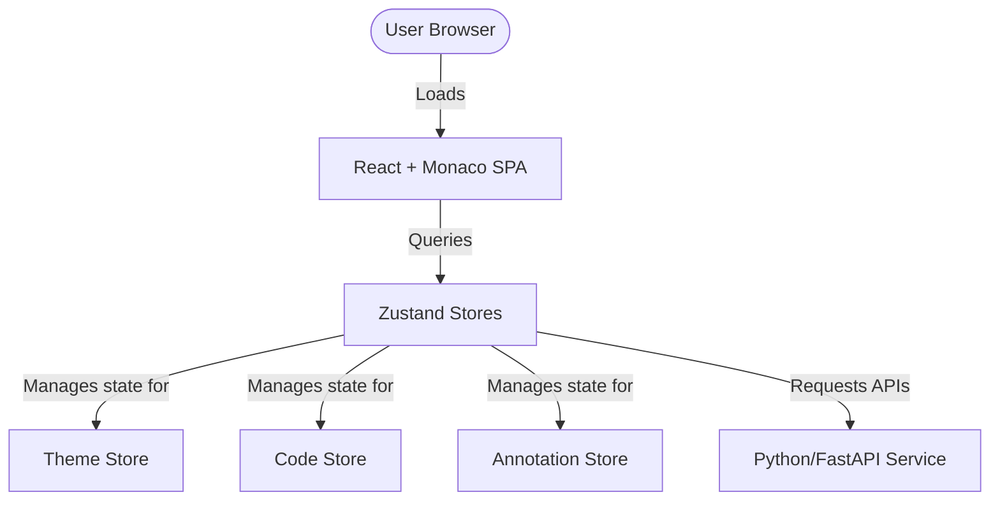

# System Architecture Documentation

This document describes the high-level architecture of the **CodeExplainer** system.

## Overview

CodeExplainer utilizes a classic client-server model organized in a monorepo setup:

## System Components

### 1. Frontend Client
- **Tech Stack**: React 18, Vite, TypeScript, Tailwind CSS, Monaco Editor (`@monaco-editor/react`).
- **State Management**: Zustand.
- **Key Features**:
  - Code Editor: Monaco-powered, interactive gutter annotation, auto-language detection.
  - Explanation Panel: Multi-depth explanation tabs (Beginner, Intermediate, Expert), line-by-line flow tracking, variables scope tables.

### 2. Backend Services (Placeholder)
- **Tech Stack**: FastAPI / Python.
- **Responsibility**: Runs code syntax trees parser, analyzes cyclomatic complexity, integrates with LLMs (e.g. Gemini API) to generate contextual code explanations.

## Data Model & Flow
1. **Code Input & Detection**: The user pastes code. The editor automatically triggers the heuristic regex-based language detector.
2. **Analysis Trigger**: When the user clicks "Explain", the code and metadata are submitted to the analyzer.
3. **Response Rendering**: The analyzer responds with standard JSON payload containing summary, complexity metrics, execution steps, and annotations.
